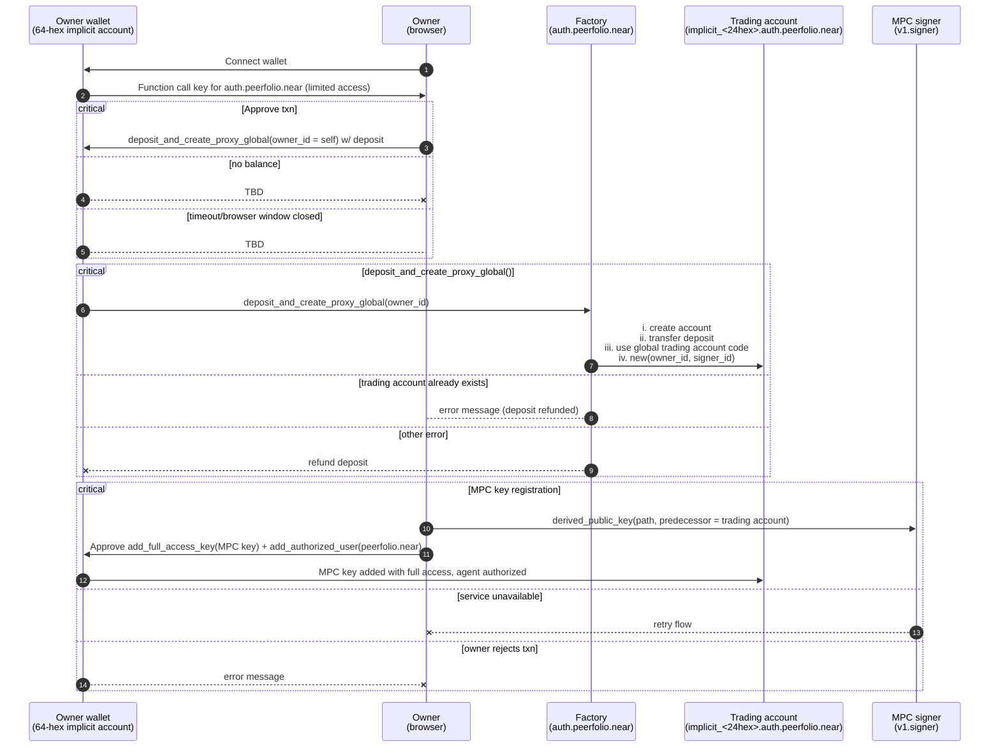
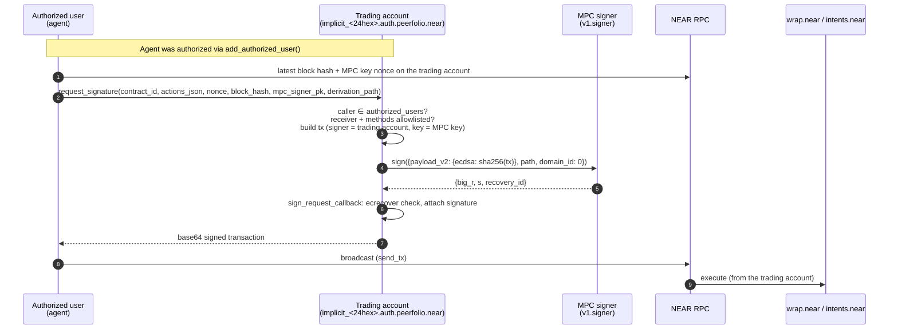

# Trading account contract

`TradingAccountContract` ([`contracts/trading-account/src/lib.rs`](../contracts/trading-account/src/lib.rs)) is the per-user contract, created by the [factory](factory.md) at `implicit_<24hex>.auth.peerfolio.near`. The owner moves only the funds they're willing to let an agent trade into it. Authorized users (agents) can then ask it to produce MPC-signed transactions from the trading account, but only for allowlisted contracts and methods.

## Security model

- The MPC signer derives a key from **(caller of `sign`, derivation path)**. Only the trading account contract itself can call `sign` as the trading account, so only this contract can obtain signatures for its MPC key. That key holds full access to the trading account.
- The contract only signs transactions whose receiver is in `ALLOWED_CONTRACTS` and whose function calls are in `ALLOWED_METHODS` ([`actions.rs`](../contracts/trading-account/src/actions.rs)):
  - contracts: `wrap.near`, `intents.near`, `wrap.testnet`
  - methods: `add_public_key`, `ft_transfer_call`, `near_deposit`, `mt_transfer_call`, `mt_transfer`, `ft_withdraw`
- **Arguments are not checked.** The method check applies to every allowed contract. For example, `ft_withdraw` / `mt_transfer` on `intents.near` can send the trading account's intents balance to **any** recipient. Treat every authorized user as able to move the trading account's funds.
- `Transfer` actions are only accepted together with at least one `FunctionCall`, and they go to the same allowlisted receiver.
- Changing the allowlist means a new global deploy and new trading accounts (see [factory.md](factory.md#existing-trading-accounts-after-a-code-change)).

## State

| Field | Meaning |
|---|---|
| `owner_id` | Set at creation: the NEAR implicit account that called the factory. No setter. |
| `authorized_users` | Up to `MAX_AUTHORIZED_USERS = 10`. |
| `signer_id` | MPC signer contract. Set by the factory and changeable via `set_signer_id`. |

## Methods

| Method | Who | Notes |
|---|---|---|
| `new(owner_id, signer_id)` | init (factory) | |
| `add_authorized_user(account_id)` | owner | Panics at 10 users. Remove one first. |
| `remove_authorized_user(account_id)` | owner | |
| `is_authorized(account_id)` | view | True for authorized users **and the owner**. |
| `get_authorized_users`, `get_owner_id`, `get_signer_id` | view | |
| `set_signer_id(signer_id)` | owner **or any authorized user** | Repoints the MPC signer. An authorized user can change it too. |
| `request_signature(contract_id, actions_json, nonce, block_hash, mpc_signer_pk, derivation_path, domain_id?)` *payable* | **authorized users only** (the owner isn't included unless added) | Needs ≥ 100 Tgas attached (300 recommended). The attached deposit is forwarded to the MPC `sign` call (attach 1 yoctoNEAR). Returns the base64 signed transaction. |
| `sign_request_callback` | private | Verifies the MPC signature with `ecrecover` and assembles the signed transaction. |
| `add_full_access_key(public_key)` | owner | Used to register the MPC key, and to add the owner's own key before deleting the account. |
| `add_full_access_key_and_register_with_intents(public_key)` *payable, exactly 1 yocto* | owner | Same as above, then also calls `intents.near.add_public_key` from the trading account. `intents.near` is hardcoded, so on testnet the intents call fails (the key is still added). |

### `request_signature` arguments

| Arg | Meaning / gotcha |
|---|---|
| `contract_id` | Receiver of the signed transaction. Must be allowlisted. |
| `actions_json` | A **JSON string** (not an object) holding an array of actions:<br>`[{"type":"FunctionCall","method_name":"near_deposit","args":{},"gas":"30000000000000","deposit":"50000000000000000000000"}]`<br>`[{"type":"Transfer","deposit":"1"}]`<br>`gas` and `deposit` are strings, `args` is a JSON value, and the list can't be empty. |
| `nonce` | The MPC key's current access-key nonce on the trading account + 1 (or more). Each pending signed transaction needs a distinct, increasing nonce. |
| `block_hash` | A recent block hash. Transactions expire after about 24h of blocks. |
| `mpc_signer_pk` | The MPC key, `secp256k1:…`. **The contract doesn't check it matches the derivation.** If it's wrong, the signature still comes back but the broadcast fails with an invalid signature. |
| `derivation_path` | Must be the path used to derive `mpc_signer_pk`. Convention: the trading account ID. |
| `domain_id` | Omit, or pass 0 (secp256k1/ECDSA). The callback only handles secp256k1 signatures. |

The output is the base64 of a borsh-encoded `SignedTransaction` from the trading account, signed with the MPC key. It's also logged as `Signed transaction (base64): …`. **The caller must broadcast it**, and gas plus any attached deposits come out of the trading account's balance.

## Onboarding



Commands for each step are in the [README walkthrough](../README.md#end-to-end-walkthrough-testnet). After onboarding the owner transfers the funds the agent may use into the trading account. Some NEAR always has to stay there for gas.

## Agent execution (swaps etc.)



## Deleting a trading account

Deleting the account only returns its **native NEAR** to the beneficiary. First withdraw wNEAR, intents balances and any other tokens back to the owner, and confirm they arrived ([withdrawal guide](https://docs.google.com/document/d/1runpneX6-h41beHh4k9FKtw3lKz6qgQbNzteR3RSCO4/)).

1. As owner, add your main account's public key to the trading account:
   ```bash
   near contract call-function as-transaction implicit_<24hex>.auth.peerfolio.testnet add_full_access_key json-args '{"public_key":"<main-account-public-key>"}' prepaid-gas '100.0 Tgas' attached-deposit '0 NEAR' sign-as <owner-id> network-config testnet sign-with-keychain send
   ```
2. Delete it with that key, sending the remainder to your main account:
   ```bash
   near account delete-account implicit_<24hex>.auth.peerfolio.testnet beneficiary <owner-id> network-config testnet sign-with-plaintext-private-key
   ```

## Unused code (left in place)

These are kept as-is because the contract code isn't being changed in this reorg:
- the `ExtSelf` / `callback_method` trait in `lib.rs`
- `NearTransaction::from_json` in `models.rs`
- the `SignatureResponse` alias, kept "for backwards compatibility"
