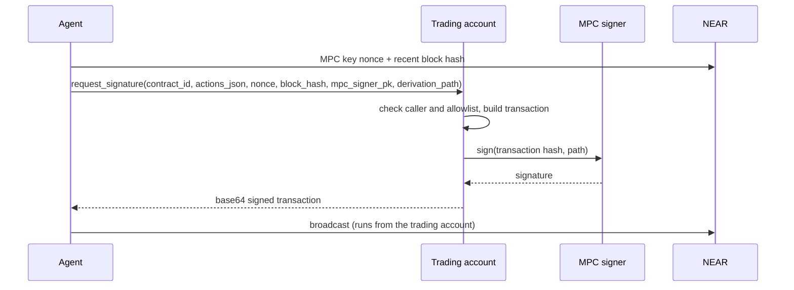

# Trading account

The per-user contract, created by the [factory](factory.md) at `implicit_<24hex>.auth.peerfolio.near`. The owner moves in only the funds an agent may trade with. Authorized users can then have the MPC signer sign transactions from the trading account, limited to an allowlist. Method details are in the [reference](reference.md#trading-account).

## Security model

- The MPC key is derived from the trading account and a derivation path, so only the trading account contract can get signatures for it. The key has full access to the trading account.
- The contract signs only transactions to allowlisted contracts and methods, defined in [`actions.rs`](../contracts/trading-account/src/actions.rs):
  - contracts: `wrap.near`, `intents.near`, `wrap.testnet`
  - methods: `add_public_key`, `ft_transfer_call`, `near_deposit`, `mt_transfer_call`, `mt_transfer`, `ft_withdraw`
- **Arguments aren't checked.** An authorized user can call `ft_withdraw` or `mt_transfer` on `intents.near` with any recipient. Only authorize accounts you trust with the trading account's funds.
- An authorized user can also change the MPC signer contract with `set_signer_id`.
- The allowlist is compiled in. Changing it means releasing new trading account code (see [factory.md](factory.md#release-trading-account-code)), and existing trading accounts keep their old code.

## Lifecycle

Commands are for testnet with near-cli-rs. `$OWNER` is a funded NEAR implicit account, `$AGENT` is the authorized user, and `$TA` is the trading account ID.

1. **Create.** The owner must sign. Store the returned account ID; don't re-derive it later.
   ```bash
   near contract call-function as-transaction auth.peerfolio.testnet deposit_and_create_proxy_global json-args "{\"owner_id\":\"$OWNER\"}" prepaid-gas '300.0 Tgas' attached-deposit '0.12 NEAR' sign-as $OWNER network-config testnet sign-with-keychain send
   ```
2. **Derive the MPC key.** By convention, the derivation path is the trading account ID.
   ```bash
   near contract call-function as-read-only v1.signer-prod.testnet derived_public_key json-args "{\"path\":\"$TA\",\"predecessor\":\"$TA\",\"domain_id\":0}" network-config testnet now
   ```
3. **Register the key and authorize the agent**, as the owner.
   ```bash
   near contract call-function as-transaction $TA add_full_access_key json-args '{"public_key":"secp256k1:<MPC key>"}' prepaid-gas '30.0 Tgas' attached-deposit '0 NEAR' sign-as $OWNER network-config testnet sign-with-keychain send
   ```
   ```bash
   near contract call-function as-transaction $TA add_authorized_user json-args "{\"account_id\":\"$AGENT\"}" prepaid-gas '30.0 Tgas' attached-deposit '0 NEAR' sign-as $OWNER network-config testnet sign-with-keychain send
   ```
4. **Fund it.** Keep some NEAR in the trading account at all times: it pays gas for every signed transaction.
5. **Trade.** The agent calls `request_signature` and broadcasts the signed transaction it returns:



For example, to wrap 0.05 NEAR and broadcast it:

```bash
near contract call-function as-transaction $TA request_signature json-args "{\"contract_id\":\"wrap.testnet\",\"actions_json\":\"[{\\\"type\\\":\\\"FunctionCall\\\",\\\"method_name\\\":\\\"near_deposit\\\",\\\"args\\\":{},\\\"gas\\\":\\\"30000000000000\\\",\\\"deposit\\\":\\\"50000000000000000000000\\\"}]\",\"nonce\":\"<nonce + 1>\",\"block_hash\":\"<block hash>\",\"mpc_signer_pk\":\"secp256k1:<MPC key>\",\"derivation_path\":\"$TA\"}" prepaid-gas '300.0 Tgas' attached-deposit '1 yoctoNEAR' sign-as $AGENT network-config testnet sign-with-keychain send
```
```bash
near transaction send-signed-transaction '<base64>' network-config testnet
```

## Deleting a trading account

Deleting the account returns only its native NEAR. First withdraw wNEAR, intents balances and any other tokens to the owner, and confirm they arrived ([withdrawal guide](https://docs.google.com/document/d/1runpneX6-h41beHh4k9FKtw3lKz6qgQbNzteR3RSCO4/)).

1. As the owner, add your own public key to the trading account:
   ```bash
   near contract call-function as-transaction $TA add_full_access_key json-args '{"public_key":"<your public key>"}' prepaid-gas '30.0 Tgas' attached-deposit '0 NEAR' sign-as $OWNER network-config testnet sign-with-keychain send
   ```
2. Delete the trading account with that key, sending the remaining NEAR to the owner:
   ```bash
   near account delete-account $TA beneficiary $OWNER network-config testnet sign-with-plaintext-private-key
   ```
